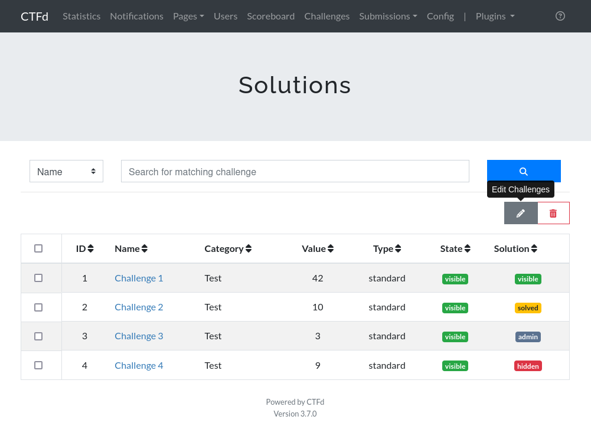

# CTFd Solutions plugin

This plugin allows the CTFd adminsitrator to include solutions in their challenges

## Installation

1. Clone this repository to [CTFd/plugins](https://github.com/CTFd/CTFd/tree/master/CTFd/plugins).
2. There are no specific python requirements for this package
3. You'll need to restart CTFd after installing the plugin. Howevevr, you'll also need to restart if you change the theme, as the challenge html template is only overwritten during the statup of CTFd for the needs of the solution plugin. If you change the theme and do not restart CTFd, the solution plugin will attempt to write to non existant places in the templates and crash.
4. In the `Admin Panel` go to `Plugins` -> `solutions`. There you will find the list of all of the challenges and the state of their solutions
5. Click on the challenge desired and you can add a solution in markdown, including images, and mark the visibility of the solution to the users. Possible values include
    `Hidden` : The solution is completely hidden on the challenge modal screen
    `Admin Only` : Only users with the adminsitrator role are capable of seeing the solutions
    `Solved` : Administrators and users qho have solved the challenge can see the user
    `Visible` : All users can see the solution

## Screenshots

